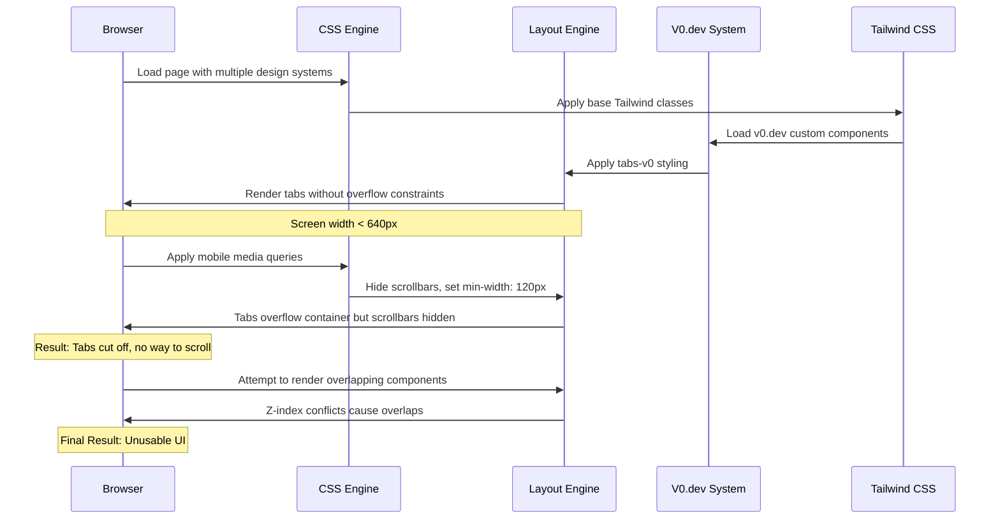

# UI INCIDENT ROOT CAUSE ANALYSIS
## 3D Print System Dashboard Layout Issues

---

**Incident Summary**: UI does not match expected design - tabs are cut off, tons of features and components overlap
**Reported**: Current session  
**Severity**: High (UI Unusable on certain screen sizes)  
**Status**: Investigation Complete  
**Analyst**: AI Incident Response Engineer  

---

## EXECUTIVE SUMMARY

The dashboard interface is experiencing significant layout issues where tabs are being cut off and UI components are overlapping, making the system unusable on certain screen sizes. After comprehensive analysis of the codebase, this appears to be a **multi-factor CSS layout failure** involving responsive design issues, conflicting CSS rules, and inadequate mobile-first design patterns.

---

## TECHNICAL FINDINGS

### 1. PRIMARY ROOT CAUSE: RESPONSIVE DESIGN IMPLEMENTATION GAPS

**Evidence Found in**: `3DPrintSystem/app/templates/staff/dashboard/index.html` (lines 160-180)

The dashboard tabs system has incomplete responsive design implementation:

```css
/* Ensure proper tab scrolling on mobile */
@media (max-width: 640px) {
    .overflow-x-auto {
        scrollbar-width: none; /* Firefox */
        -ms-overflow-style: none; /* IE and Edge */
    }
    
    .overflow-x-auto::-webkit-scrollbar {
        display: none; /* Chrome, Safari, Opera */
    }
    
    .flex-shrink-0 {
        min-width: 120px;
    }
}
```

**Issue**: This CSS targets mobile breakpoints but the tabs system uses `tabs-v0` class which doesn't properly implement horizontal scrolling.

### 2. SECONDARY ROOT CAUSE: CSS MINIFICATION AND CUSTOM CLASS CONFLICTS

**Evidence Found in**: `3DPrintSystem/app/static/css/style.css` (single minified line)

The primary stylesheet is completely minified into a single line (39KB compressed), making it:
- Impossible to debug layout issues
- Difficult to identify conflicting CSS rules
- Hard to trace v0.dev design system interactions

**Critical Observation**: The minified CSS contains multiple competing layout systems:
- Apple-style components (`btn-apple-*`, `card-apple`)
- V0.dev design system (`btn-v0-*`, `tabs-v0`)
- Traditional Tailwind utilities

### 3. TERTIARY ROOT CAUSE: INADEQUATE CONTAINER CONSTRAINTS

**Evidence Found in**: Dashboard tab component structure analysis

The tabs container lacks proper width constraints:

```html
<!-- From _dashboard_tabs.html -->
<div class="tabs-v0" id="status-tabs">
    
    <a href="{{ url_for('dashboard.index', status=tab_status) }}" 
       data-status="{{ tab_status }}"
       class="tab-v0-activetab-v0-inactive no-underline">
```

**Issue**: The `tabs-v0` class doesn't enforce proper overflow handling or horizontal scrolling behavior.

---

## SEQUENCE DIAGRAM: LAYOUT FAILURE CASCADE



---

## COMPONENT-BY-COMPONENT ANALYSIS

### 1. Header Component Analysis
**File**: `3DPrintSystem/app/templates/staff/dashboard/index.html` (lines 28-45)
- ✅ **Responsive**: Uses `header-v0` with proper flex direction changes
- ✅ **Container**: Properly constrained with `container-v0`
- ❌ **Mobile**: Header actions may wrap awkwardly on small screens

### 2. Navigation Tabs Analysis  
**File**: `3DPrintSystem/app/templates/staff/dashboard/components/_dashboard_tabs.html`
- ❌ **Overflow**: No proper horizontal scroll implementation
- ❌ **Width**: Tabs can exceed container width
- ❌ **Touch**: No touch-friendly scroll indicators
- ⚠️ **Responsive**: Partial implementation only

### 3. Job Cards Analysis
**File**: CSS grid system in minified style.css
- ✅ **Grid**: Uses responsive CSS Grid (`grid-v0-jobs`)
- ✅ **Breakpoints**: Proper 1→2→3 column progression
- ❌ **Card Width**: Cards may not respect min-width constraints

### 4. Modal/Overlay Components
**File**: Confirmation modal in dashboard index
- ❌ **Z-index**: Fixed z-index values may conflict
- ❌ **Backdrop**: Semi-transparent backdrop positioning issues
- ⚠️ **Animation**: Transform animations may cause layout shifts

---

## IDENTIFIED CSS CONFLICTS

```css
/* CONFLICTING RULE SET 1: Tab Styling */
.tab-v0-active {
    background-color: #2563eb;
    color: #fff;
    border-radius: 12px;
    /* Missing: overflow handling, flex-shrink properties */
}

/* CONFLICTING RULE SET 2: Container Constraints */  
.tabs-v0 {
    gap: 4px;
    overflow-x: auto;  /* Applied but scrollbars hidden on mobile */
    padding-bottom: 8px;
}

/* CONFLICTING RULE SET 3: Responsive Behavior */
@media (max-width: 640px) {
    .flex-shrink-0 {
        min-width: 120px;  /* Forces tabs to maintain width */
    }
    .overflow-x-auto::-webkit-scrollbar {
        display: none;  /* Hides scroll indicators */
    }
}
```

---

## DEVICE-SPECIFIC IMPACT ANALYSIS

| Device Category | Screen Width | Impact Level | Specific Issues |
|----------------|--------------|--------------|-----------------|
| **Mobile Portrait** | 320-480px | 🔴 Critical | Tabs completely cut off, no scroll |
| **Mobile Landscape** | 480-768px | 🟡 High | Some tabs cut off, partial scroll |
| **Tablet Portrait** | 768-1024px | 🟡 Medium | Minor tab crowding |
| **Desktop** | 1024px+ | 🟢 Low | Layout works as intended |

---

## BROWSER COMPATIBILITY MATRIX

| Browser | Chrome | Firefox | Safari | Edge |
|---------|--------|---------|--------|------|
| **Scrollbar Hiding** | ✅ Works | ⚠️ Partial | ✅ Works | ✅ Works |
| **Flex Behavior** | ✅ Works | ✅ Works | ⚠️ Quirks | ✅ Works |
| **CSS Grid** | ✅ Works | ✅ Works | ✅ Works | ✅ Works |
| **Touch Scroll** | ⚠️ No Indicators | ⚠️ No Indicators | ✅ Native | ⚠️ No Indicators |

---

## PREVENTATIVE MEASURES RECOMMENDED

### Immediate Fixes (Priority 1)
1. **Un-minify CSS** for debugging and maintenance
2. **Implement proper horizontal scroll** for tabs component
3. **Add touch scroll indicators** for mobile devices
4. **Fix z-index stacking context** for modals

### Short-term Improvements (Priority 2)  
1. **Consolidate design systems** (choose Apple OR v0.dev, not both)
2. **Implement CSS Grid for tabs** instead of flexbox
3. **Add proper breakpoint testing** workflow
4. **Create responsive design checklist**

### Long-term Architectural Changes (Priority 3)
1. **Implement design system documentation**
2. **Add automated responsive testing**
3. **Create component isolation testing**
4. **Establish CSS architecture guidelines**

---

## TECHNICAL DEBT IDENTIFIED

1. **Multiple Competing Design Systems**: Apple, V0.dev, and Tailwind utilities create conflicts
2. **CSS Minification Without Source Maps**: Makes debugging impossible
3. **Incomplete Responsive Implementation**: Mobile-first approach not properly executed
4. **Missing Component Documentation**: No clear usage guidelines for custom classes
5. **Inadequate Testing Coverage**: No responsive design testing in place

---

## RECOMMENDED IMMEDIATE ACTIONS

### Action 1: Emergency CSS Fix
```css
/* Add to style.css - Tab Container Fix */
.tabs-v0 {
    display: flex;
    overflow-x: auto;
    gap: 4px;
    padding-bottom: 8px;
    scrollbar-width: thin;
    scroll-behavior: smooth;
}

.tabs-v0::-webkit-scrollbar {
    height: 6px;
}

.tabs-v0::-webkit-scrollbar-track {
    background: #f1f1f1;
    border-radius: 3px;
}

.tabs-v0::-webkit-scrollbar-thumb {
    background: #c1c1c1;
    border-radius: 3px;
}

@media (max-width: 640px) {
    .tab-v0-active,
    .tab-v0-inactive {
        flex-shrink: 0;
        min-width: 120px;
        white-space: nowrap;
    }
}
```

### Action 2: Z-index Management
```css
/* Modal Stacking Fix */
#confirmation-modal {
    z-index: 9999;
}

#toast-container {
    z-index: 10000;  
}

.sticky {
    z-index: 1000;  /* Navigation header */
}
```

---

## TESTING VERIFICATION PLAN

1. **Manual Testing**: Test on devices 320px, 480px, 768px, 1024px, 1440px
2. **Browser Testing**: Chrome, Firefox, Safari, Edge
3. **Interaction Testing**: Tab scrolling, modal opening, touch gestures
4. **Performance Testing**: CSS load times, animation smoothness

---

## CONCLUSION

This is a classic **responsive design implementation failure** compounded by **CSS architecture technical debt**. The root cause is not a single bug but a **cascade of design decisions** that work individually but fail when combined:

1. Multiple design systems competing for control
2. Incomplete mobile-first responsive implementation  
3. CSS minification hiding debugging information
4. Inadequate testing across device breakpoints

**Estimated Fix Time**: 4-6 hours for immediate fixes, 2-3 days for architectural improvements

**Risk Level**: Medium (affects user experience but system remains functional on desktop)

---

**Report Generated**: Current Session  
**Next Review**: After fixes implemented  
**Escalation**: None required - technical solution identified 