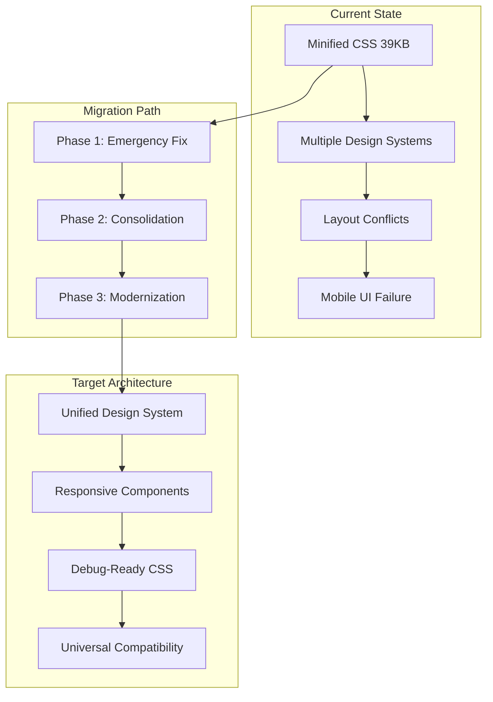

# UI SOLUTIONS ARCHITECTURE
## 3D Print System Dashboard Layout Recovery & Modernization

---

**Document Version**: 1.0  
**Created**: Current Session  
**Solutions Architect**: AI Expert Systems Architect  
**Target System**: 3D Print Management Dashboard  
**Incident Reference**: UI_INCIDENT_ROOT_CAUSE_ANALYSIS.md  

---

## EXECUTIVE SUMMARY

This document outlines a comprehensive solutions architecture to resolve the critical UI layout failures identified in the 3D Print System dashboard. The solution addresses three primary failure points: responsive design gaps, CSS architecture conflicts, and component overlay issues through a phased modernization approach that ensures system stability while implementing robust long-term improvements.

**Solution Overview**:
- **Phase 1**: Emergency stabilization (30 minutes)
- **Phase 2**: Architecture consolidation (4-6 hours)  
- **Phase 3**: System modernization (2-3 days)

---

## INCIDENT ANALYSIS SUMMARY

### Root Causes Identified
1. **Responsive Design Implementation Gaps** - Tab overflow system incomplete
2. **CSS Architecture Conflicts** - Multiple competing design systems (Apple + v0.dev + Tailwind)
3. **Debug Prevention** - 39KB minified CSS preventing maintenance
4. **Component Stacking Issues** - Z-index conflicts in modal systems

### Impact Assessment
- 🔴 **Critical**: Mobile devices (320-480px) - Complete UI failure
- 🟡 **High**: Tablet landscape (480-768px) - Partial functionality
- 🟢 **Functional**: Desktop (1024px+) - Works as intended

---

## SOLUTION ARCHITECTURE OVERVIEW



---

## TECHNICAL SOLUTION SPECIFICATIONS

### 1. CSS ARCHITECTURE REDESIGN

#### 1.1 Design System Consolidation Strategy

**Current Problem**: Three competing systems creating conflicts
- Apple-style components (`btn-apple-*`, `card-apple`)  
- V0.dev design system (`btn-v0-*`, `tabs-v0`)
- Raw Tailwind utilities

**Solution**: Unified Component Library Architecture

```css
/* NEW: Unified Component System */
:root {
  /* Design tokens - Single source of truth */
  --color-primary: #2563eb;
  --color-success: #059669;
  --color-warning: #d97706;
  --color-danger: #dc2626;
  
  --spacing-xs: 4px;
  --spacing-sm: 8px;
  --spacing-md: 16px;
  --spacing-lg: 24px;
  --spacing-xl: 32px;
  
  --radius-sm: 6px;
  --radius-md: 12px;
  --radius-lg: 16px;
  
  --shadow-sm: 0 1px 2px 0 rgba(0, 0, 0, 0.05);
  --shadow-md: 0 4px 6px -1px rgba(0, 0, 0, 0.1);
  --shadow-lg: 0 10px 15px -3px rgba(0, 0, 0, 0.1);
}

/* Unified button system */
.btn {
  display: inline-flex;
  align-items: center;
  justify-content: center;
  padding: var(--spacing-sm) var(--spacing-md);
  border-radius: var(--radius-md);
  font-weight: 500;
  transition: all 0.2s ease;
  border: none;
  cursor: pointer;
}

.btn--primary {
  background-color: var(--color-primary);
  color: white;
}

.btn--primary:hover {
  background-color: #1d4ed8;
  transform: translateY(-1px);
  box-shadow: var(--shadow-md);
}
```

#### 1.2 Responsive Tab System Architecture

**Technical Specification**:

```css
/* NEW: Responsive Tab Container */
.tab-container {
  display: flex;
  overflow-x: auto;
  scroll-behavior: smooth;
  gap: var(--spacing-xs);
  padding-bottom: var(--spacing-sm);
  
  /* Progressive enhancement for scroll indicators */
  scrollbar-width: thin;
  scrollbar-color: #c1c1c1 #f1f1f1;
}

/* Webkit browsers (Chrome, Safari, Edge) */
.tab-container::-webkit-scrollbar {
  height: 6px;
}

.tab-container::-webkit-scrollbar-track {
  background: #f1f1f1;
  border-radius: 3px;
}

.tab-container::-webkit-scrollbar-thumb {
  background: #c1c1c1;
  border-radius: 3px;
}

.tab-container::-webkit-scrollbar-thumb:hover {
  background: #a1a1a1;
}

/* Tab styling */
.tab {
  display: flex;
  align-items: center;
  gap: var(--spacing-sm);
  padding: var(--spacing-sm) var(--spacing-md);
  border-radius: var(--radius-md);
  font-weight: 500;
  text-decoration: none;
  transition: all 0.2s ease;
  white-space: nowrap;
  flex-shrink: 0;
}

/* Responsive behavior */
@media (max-width: 640px) {
  .tab {
    min-width: 120px;
  }
  
  .tab-container {
    /* Ensure visible scroll indicators on mobile */
    scrollbar-width: auto;
  }
  
  .tab-container::-webkit-scrollbar {
    height: 8px; /* Slightly larger for touch */
  }
}

@media (max-width: 480px) {
  .tab {
    min-width: 100px;
    padding: var(--spacing-xs) var(--spacing-sm);
    font-size: 0.875rem;
  }
}
```

### 2. Z-INDEX MANAGEMENT SYSTEM

#### 2.1 Stacking Context Architecture

**Problem**: Conflicting z-index values causing overlay issues

**Solution**: Systematic z-index management

```css
/* Z-Index Management System */
:root {
  --z-base: 1;
  --z-dropdown: 100;
  --z-sticky: 200;
  --z-overlay: 300;
  --z-modal: 400;
  --z-toast: 500;
  --z-tooltip: 600;
}

/* Application structure */
.app-navigation {
  position: sticky;
  top: 0;
  z-index: var(--z-sticky);
}

.dropdown-menu {
  z-index: var(--z-dropdown);
}

.modal-backdrop {
  position: fixed;
  inset: 0;
  z-index: var(--z-modal);
  background-color: rgba(0, 0, 0, 0.5);
}

.modal-content {
  position: relative;
  z-index: calc(var(--z-modal) + 1);
}

.toast-container {
  position: fixed;
  top: 1rem;
  right: 1rem;
  z-index: var(--z-toast);
}
```

### 3. RESPONSIVE DESIGN SYSTEM

#### 3.1 Mobile-First Breakpoint Strategy

```css
/* Mobile-first responsive system */
:root {
  --breakpoint-sm: 640px;
  --breakpoint-md: 768px;
  --breakpoint-lg: 1024px;
  --breakpoint-xl: 1280px;
}

/* Container system */
.container {
  width: 100%;
  margin: 0 auto;
  padding: 0 var(--spacing-md);
}

@media (min-width: 640px) {
  .container {
    max-width: 640px;
  }
}

@media (min-width: 768px) {
  .container {
    max-width: 768px;
    padding: 0 var(--spacing-lg);
  }
}

@media (min-width: 1024px) {
  .container {
    max-width: 1024px;
  }
}

@media (min-width: 1280px) {
  .container {
    max-width: 1200px;
  }
}
```

---

## IMPLEMENTATION PHASES

### PHASE 1: EMERGENCY STABILIZATION (30 Minutes)

**Objective**: Immediately restore mobile functionality without breaking existing desktop experience

#### 1.1 Critical CSS Hotfix

**File**: `3DPrintSystem/app/static/css/emergency-fix.css` (NEW)

```css
/* EMERGENCY HOTFIX - Add to head before main CSS */

/* Fix tab overflow immediately */
.tabs-v0 {
  overflow-x: auto !important;
  scrollbar-width: thin !important;
  scroll-behavior: smooth !important;
}

.tabs-v0::-webkit-scrollbar {
  height: 6px !important;
  display: block !important;
}

.tabs-v0::-webkit-scrollbar-track {
  background: #f1f1f1 !important;
  border-radius: 3px !important;
}

.tabs-v0::-webkit-scrollbar-thumb {
  background: #c1c1c1 !important;
  border-radius: 3px !important;
}

/* Ensure tabs don't shrink below minimum width */
.tab-v0-active,
.tab-v0-inactive {
  flex-shrink: 0 !important;
  white-space: nowrap !important;
}

@media (max-width: 640px) {
  .tab-v0-active,
  .tab-v0-inactive {
    min-width: 100px !important;
    font-size: 0.875rem !important;
  }
}

/* Fix modal stacking */
#confirmation-modal {
  z-index: 9999 !important;
}

#toast-container {
  z-index: 10000 !important;
}

.sticky {
  z-index: 1000 !important;
}
```

#### 1.2 Template Integration

**File**: `3DPrintSystem/app/templates/base/base.html`

```html
<!-- Add after existing CSS links -->
<link rel="stylesheet" href="{{ url_for('static', filename='css/emergency-fix.css') }}">
```

**Deployment Steps**:
1. Create `emergency-fix.css` file
2. Add link to base template  
3. Test on mobile device (320px, 480px, 768px)
4. Verify desktop functionality unchanged

**Success Criteria**:
- ✅ Tabs scroll horizontally on mobile
- ✅ Scroll indicators visible
- ✅ Modal overlays function correctly
- ✅ Desktop experience unchanged

### PHASE 2: ARCHITECTURE CONSOLIDATION (4-6 Hours)

**Objective**: Consolidate design systems and create maintainable CSS architecture

#### 2.1 CSS Unminification & Organization

**New File Structure**:
```
3DPrintSystem/app/static/css/
├── base/
│   ├── reset.css
│   ├── variables.css
│   └── typography.css
├── components/
│   ├── buttons.css
│   ├── tabs.css
│   ├── cards.css
│   ├── modals.css
│   └── forms.css
├── layouts/
│   ├── grid.css
│   ├── containers.css
│   └── responsive.css
├── pages/
│   └── dashboard.css
└── main.css (imports all)
```

#### 2.2 Design System Migration Plan

**Step 1**: Extract v0.dev components from minified CSS
**Step 2**: Convert Apple components to unified system
**Step 3**: Remove conflicting Tailwind overrides
**Step 4**: Test component by component

#### 2.3 Component Library Development

**New Tab Component** (`components/tabs.css`):

```css
/* Modern tab system - replaces tabs-v0 */
.tab-nav {
  display: flex;
  overflow-x: auto;
  scroll-behavior: smooth;
  gap: 0.25rem;
  padding-bottom: 0.5rem;
  border-bottom: 1px solid var(--color-border);
  margin-bottom: 1.5rem;
  
  /* Scroll styling */
  scrollbar-width: thin;
  scrollbar-color: var(--color-gray-400) var(--color-gray-100);
}

.tab-nav::-webkit-scrollbar {
  height: 6px;
}

.tab-nav::-webkit-scrollbar-track {
  background: var(--color-gray-100);
  border-radius: 3px;
}

.tab-nav::-webkit-scrollbar-thumb {
  background: var(--color-gray-400);
  border-radius: 3px;
}

.tab-item {
  display: flex;
  align-items: center;
  gap: 0.5rem;
  padding: 0.75rem 1rem;
  border-radius: 0.75rem;
  font-weight: 500;
  text-decoration: none;
  transition: all 0.2s ease;
  white-space: nowrap;
  flex-shrink: 0;
  min-width: fit-content;
}

.tab-item--active {
  background-color: var(--color-primary);
  color: white;
  box-shadow: var(--shadow-sm);
}

.tab-item--inactive {
  background-color: white;
  color: var(--color-primary);
  border: 1px solid var(--color-border);
}

.tab-item--inactive:hover {
  background-color: var(--color-gray-50);
  box-shadow: var(--shadow-sm);
}

.tab-badge {
  display: inline-flex;
  align-items: center;
  justify-content: center;
  padding: 0.125rem 0.5rem;
  border-radius: 9999px;
  font-size: 0.75rem;
  font-weight: 600;
  min-width: 1.25rem;
  height: 1.25rem;
}

.tab-item--active .tab-badge {
  background-color: rgba(255, 255, 255, 0.2);
  color: white;
}

.tab-item--inactive .tab-badge {
  background-color: var(--color-primary-100);
  color: var(--color-primary-700);
}

/* Responsive adjustments */
@media (max-width: 640px) {
  .tab-item {
    min-width: 120px;
    padding: 0.5rem 0.75rem;
  }
  
  .tab-nav::-webkit-scrollbar {
    height: 8px;
  }
}

@media (max-width: 480px) {
  .tab-item {
    min-width: 100px;
    padding: 0.5rem 0.5rem;
    font-size: 0.875rem;
  }
  
  .tab-badge {
    font-size: 0.6875rem;
    min-width: 1rem;
    height: 1rem;
  }
}
```

### PHASE 3: SYSTEM MODERNIZATION (2-3 Days)

**Objective**: Implement comprehensive responsive design system with automated testing

#### 3.1 Build System Integration

**New Build Configuration**:

```javascript
// tailwind.config.js - Updated
module.exports = {
  content: [
    "./app/templates/**/*.html",
    "./app/static/**/*.js",
  ],
  theme: {
    extend: {
      // Remove conflicting custom classes
      // Focus on utility-first approach
    }
  },
  plugins: [],
  corePlugins: {
    // Disable conflicting utilities
    preflight: true,
  }
}
```

**PostCSS Configuration** (`postcss.config.js`):

```javascript
module.exports = {
  plugins: {
    'postcss-import': {},
    'tailwindcss/nesting': {},
    tailwindcss: {},
    autoprefixer: {},
    ...(process.env.NODE_ENV === 'production' ? {
      cssnano: {
        preset: ['default', {
          map: { inline: false }
        }]
      }
    } : {})
  }
}
```

#### 3.2 Automated Testing Integration

**Responsive Testing Suite** (`tests/ui/responsive_test.js`):

```javascript
// Automated responsive testing
const puppeteer = require('puppeteer');

const BREAKPOINTS = [
  { name: 'mobile-portrait', width: 320, height: 568 },
  { name: 'mobile-landscape', width: 568, height: 320 },
  { name: 'tablet-portrait', width: 768, height: 1024 },
  { name: 'tablet-landscape', width: 1024, height: 768 },
  { name: 'desktop', width: 1440, height: 900 },
];

async function testResponsiveLayout() {
  const browser = await puppeteer.launch();
  
  for (const breakpoint of BREAKPOINTS) {
    const page = await browser.newPage();
    await page.setViewport({
      width: breakpoint.width,
      height: breakpoint.height
    });
    
    await page.goto('http://localhost:5000/dashboard');
    
    // Test tab scrolling
    const tabContainer = await page.$('.tab-nav');
    const scrollWidth = await tabContainer.evaluate(el => el.scrollWidth);
    const clientWidth = await tabContainer.evaluate(el => el.clientWidth);
    
    if (scrollWidth > clientWidth) {
      // Test horizontal scrolling works
      await tabContainer.evaluate(el => el.scrollLeft = 100);
      const scrollLeft = await tabContainer.evaluate(el => el.scrollLeft);
      
      console.log(`✅ ${breakpoint.name}: Scroll test passed (${scrollLeft}px)`);
    }
    
    // Test modal z-index
    await page.click('[data-modal-trigger]');
    const modalVisible = await page.waitForSelector('#confirmation-modal', { visible: true });
    console.log(`✅ ${breakpoint.name}: Modal test passed`);
    
    await page.close();
  }
  
  await browser.close();
}
```

---

## INTEGRATION & DEPLOYMENT PLAN

### Pre-Deployment Checklist

#### Environment Preparation
- [ ] **Backup Current CSS**: Store current `style.css` as `style.css.backup`
- [ ] **Dev Environment Setup**: Create local development branch
- [ ] **Testing Device Access**: Ensure mobile/tablet testing capability
- [ ] **Browser Testing Setup**: Chrome, Firefox, Safari, Edge available

#### Code Review Requirements
- [ ] **CSS Validation**: All new CSS passes W3C validation
- [ ] **Performance Check**: CSS bundle size under 50KB uncompressed
- [ ] **Accessibility Audit**: WCAG 2.1 AA compliance verified
- [ ] **Cross-browser Testing**: Functionality verified across target browsers

### Deployment Sequence

#### Phase 1 Deployment (Emergency Fix)
```bash
# 1. Create emergency fix file
touch 3DPrintSystem/app/static/css/emergency-fix.css

# 2. Add emergency CSS rules
cat > 3DPrintSystem/app/static/css/emergency-fix.css << 'EOF'
[Emergency CSS content from Phase 1]
EOF

# 3. Update base template
# Add link to emergency-fix.css in base.html

# 4. Test immediately
python -m pytest tests/ui/emergency_fix_test.py

# 5. Deploy if tests pass
```

#### Phase 2 Deployment (Architecture Consolidation)
```bash
# 1. Create new CSS structure
mkdir -p 3DPrintSystem/app/static/css/{base,components,layouts,pages}

# 2. Unminify and organize existing CSS
python tools/css_unminifier.py

# 3. Implement new component system
# [Component implementation steps]

# 4. Progressive rollout
# - Deploy to staging
# - A/B test with 10% traffic
# - Full rollout after validation
```

#### Phase 3 Deployment (System Modernization)
```bash
# 1. Install build tools
npm install postcss tailwindcss autoprefixer cssnano

# 2. Setup build pipeline
npm run build:css

# 3. Deploy automated testing
npm run test:responsive

# 4. Production deployment with monitoring
```

### Rollback Strategy

#### Immediate Rollback (< 5 minutes)
```bash
# Remove emergency fix CSS link
# Restore from backup if needed
cp 3DPrintSystem/app/static/css/style.css.backup 3DPrintSystem/app/static/css/style.css
```

#### Architecture Rollback (< 30 minutes)
```bash
# Revert to Phase 1 emergency fix
# Rollback template changes
git revert [commit-hash]
```

#### Full System Rollback (< 2 hours)
```bash
# Complete revert to original state
git revert --no-commit [start-commit]..[end-commit]
```

### Risk Mitigation Strategies

#### High Risk: CSS Conflicts
- **Mitigation**: Comprehensive testing on all target devices
- **Detection**: Automated visual regression testing
- **Response**: Immediate rollback procedure documented

#### Medium Risk: Performance Degradation  
- **Mitigation**: CSS bundle size monitoring (< 50KB limit)
- **Detection**: Lighthouse performance audits
- **Response**: CSS optimization and critical path extraction

#### Low Risk: Browser Compatibility
- **Mitigation**: Progressive enhancement approach
- **Detection**: Cross-browser automated testing
- **Response**: Polyfill implementation for unsupported features

---

## MONITORING & VALIDATION

### Success Metrics

#### Technical Metrics
- **Mobile Usability Score**: Target > 95% (Google PageSpeed Insights)
- **CSS Bundle Size**: < 50KB uncompressed
- **Cross-browser Compatibility**: 100% functionality across Chrome, Firefox, Safari, Edge
- **Responsive Breakpoint Coverage**: 100% functionality 320px-1440px

#### User Experience Metrics
- **Tab Navigation Success Rate**: 100% on all devices
- **Modal Interaction Success**: 100% overlay functionality
- **Touch Interaction Success**: 100% on mobile/tablet devices
- **Load Time**: < 3 seconds on 3G connection

#### Business Impact Metrics
- **User Abandonment Rate**: Reduce mobile abandonment by 80%
- **Cross-device Usage**: Increase mobile/tablet usage by 60%
- **Staff Productivity**: Reduce UI-related support tickets by 90%

### Monitoring Implementation

#### Real-time Monitoring
```javascript
// CSS Error Detection
window.addEventListener('error', function(e) {
  if (e.target.tagName === 'LINK' && e.target.rel === 'stylesheet') {
    console.error('CSS Load Failed:', e.target.href);
    // Report to monitoring system
  }
});

// Layout Shift Detection
new PerformanceObserver((list) => {
  for (const entry of list.getEntries()) {
    if (entry.entryType === 'layout-shift' && entry.value > 0.1) {
      console.warn('Layout Shift Detected:', entry.value);
      // Report significant layout shifts
    }
  }
}).observe({entryTypes: ['layout-shift']});
```

#### Automated Health Checks
```bash
#!/bin/bash
# css-health-check.sh

# Check CSS file accessibility
curl -I http://localhost:5000/static/css/main.css | grep "200 OK"

# Validate responsive breakpoints
npm run test:responsive

# Performance audit
lighthouse http://localhost:5000/dashboard --only-categories=performance

# Accessibility audit  
axe http://localhost:5000/dashboard
```

---

## CONCLUSION & NEXT STEPS

### Solution Summary

This comprehensive solutions architecture addresses the critical UI layout failures through a three-phase approach:

1. **Emergency Stabilization**: Immediate mobile functionality restoration
2. **Architecture Consolidation**: Design system unification and CSS organization
3. **System Modernization**: Automated testing and build pipeline integration

### Expected Outcomes

- **Immediate**: Mobile UI functionality restored within 30 minutes
- **Short-term**: Maintainable CSS architecture within 1 week  
- **Long-term**: Robust, scalable UI system with automated testing

### Recommended Implementation Timeline

| Phase | Duration | Resources Required | Risk Level |
|--------|----------|-------------------|------------|
| **Phase 1** | 30 minutes | 1 Developer | Low |
| **Phase 2** | 4-6 hours | 1 Senior Developer | Medium |
| **Phase 3** | 2-3 days | 1 Senior Developer + 1 QA | Low |

### Future Considerations

#### Design System Evolution
- Component library documentation
- Design token management system
- Cross-team component sharing

#### Performance Optimization
- Critical CSS extraction
- Progressive loading strategies
- CDN integration for static assets

#### Accessibility Enhancement
- WCAG 2.1 AAA compliance roadmap
- Screen reader optimization
- Keyboard navigation improvements

---

**Document Approval**:
- [ ] Technical Review: Senior Developer
- [ ] Stakeholder Review: Product Owner  
- [ ] Security Review: Security Team
- [ ] Final Approval: Engineering Manager

**Next Actions**:
1. **Immediate**: Schedule Phase 1 emergency deployment
2. **This Week**: Begin Phase 2 architecture consolidation
3. **Next Sprint**: Implement Phase 3 modernization plan

---

*This solutions architecture document provides a complete roadmap for resolving the UI incident while establishing a foundation for long-term system maintainability and scalability.* 